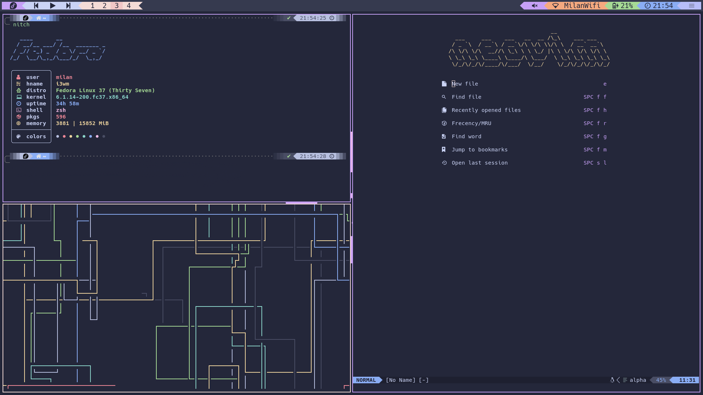

# catppuccin.dots
i3wm dot files for [Catppuccin](https://github.com/catppuccin/catppuccin) themed rice.



### :sparkles: Features
- i3
- Polybar
- Neovim
- Tmux
- Rofi
- Alacritty

## :wrench: Usage
Clone this repository:

```bash
git clone https://github.com/milanrocher/catppuccin.dots.git
```

Copy the config files to your .config directory:

```bash
cd catppuccin.dots/.config
cp * ${HOME}/
```

Copy the wallpaper to your Pictures directory:

```bash
cd catppuccin.dots/wallpaper
cp * ${HOME}/Pictures/
```

## :paperclip: Contact
Milan Rocher \
<milanrocher@gmail.com>
